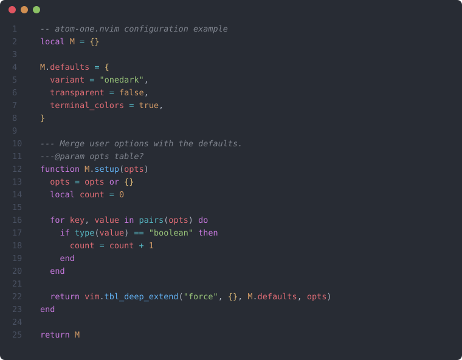
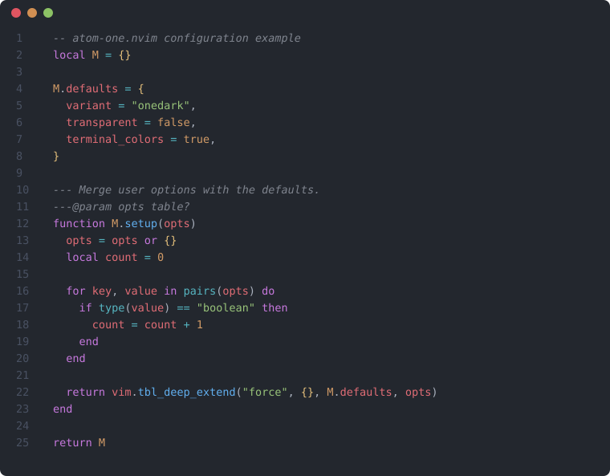
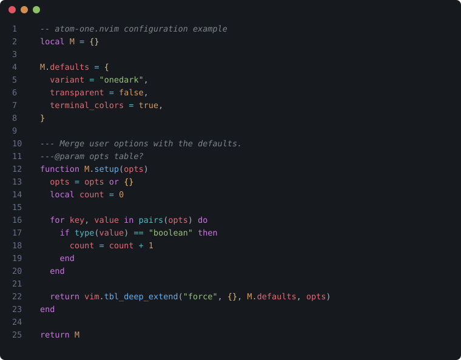

# atom-one.nvim

A faithful [Neovim](https://github.com/neovim/neovim) port of the 5 official
**One Dark Pro** variants (the theme that started life as Atom's built-in
"One Dark", later extended by
[Binaryify/OneDark-Pro](https://github.com/Binaryify/OneDark-Pro) for VS
Code): `OneDark Pro`, `Darker`, `Flat`, `Mix`, and `Night Flat`.

This is **not** a fork of, and does not compete with,
[`olimorris/onedarkpro.nvim`](https://github.com/olimorris/onedarkpro.nvim) -
that plugin already exists, is actively maintained, and covers a much wider
surface (many more plugin integrations). This project exists because its
palette didn't match the original VS Code extension closely enough: every
color here is traced back to the actual `tokenColors`/`semanticTokenColors`
entries in the upstream theme's JSON, not approximated from memory of what
"One Dark" usually looks like.

## Screenshots

<table width="100%">
  <tr>
    <th>OneDark Pro (default)</th>
    <th>Darker</th>
  </tr>
  <tr>
    <td width="50%"></td>
    <td width="50%"></td>
  </tr>
  <tr>
    <th>Flat</th>
    <th>Mix</th>
  </tr>
  <tr>
    <td width="50%"></td>
    <td width="50%"></td>
  </tr>
  <tr>
    <th>Night Flat</th>
    <th></th>
  </tr>
  <tr>
    <td width="50%"></td>
    <td width="50%"></td>
  </tr>
</table>

These are generated, not hand-drawn: each one is real Neovim Treesitter
output rendered to SVG with the colorscheme's actual resolved
`nvim_get_hl` values, so what you see is what you get.

## Features

- All 5 official One Dark Pro variants, each its own `:colorscheme`.
- Treesitter (`@capture`) highlighting, hand-mapped from the upstream
  theme's TextMate scopes - not a generic/approximate port.
- LSP semantic token (`@lsp.type.*` / `@lsp.typemod.*`) support.
- Terminal ANSI colors (`:terminal`, and anything that shells out).
- No dependencies beyond Neovim itself.

Out of scope for now: plugin-specific highlight groups (telescope,
gitsigns, cmp, lualine, etc.). This plugin covers the baseline every
colorscheme needs regardless of what's installed; integrations may follow
later, added one at a time as they're actually needed.

## Requirements

- [Neovim](https://github.com/neovim/neovim) >=
  [0.9.0](https://github.com/neovim/neovim/releases/tag/v0.9.0) (for
  Treesitter highlighting and semantic tokens)

## Installation

Install with your preferred package manager, such as
[folke/lazy.nvim](https://github.com/folke/lazy.nvim):

```lua
{
  "isaias-alt/atom-one.nvim",
  lazy = false,
  priority = 1000,
  config = function()
    vim.cmd.colorscheme("atom-one")
  end,
}
```

## Usage

```vim
colorscheme atom-one

" There's also a colorscheme for each variant.
colorscheme atom-one-darker
colorscheme atom-one-flat
colorscheme atom-one-mix
colorscheme atom-one-night-flat
```

```lua
vim.cmd.colorscheme("atom-one")
```

## Configuration

> [!IMPORTANT]
> Set the configuration **before** loading the colorscheme.

`atom-one.nvim` uses the default options below unless `setup()` is called
explicitly:

```lua
require("atom-one").setup({
  variant = "onedark", -- "onedark" | "darker" | "flat" | "mix" | "night_flat"
  transparent = false, -- don't set a background color, let the terminal show through
  terminal_colors = true, -- set g:terminal_color_0..15 for `:terminal`

  styles = {
    -- Style to apply to specific syntax groups.
    -- Value is any valid attr-list value for `:help nvim_set_hl`.
    comments = { italic = true },
    keywords = {},
    functions = {},
    variables = {},
  },

  -- Override palette colors before they're used to build highlight groups.
  ---@param colors table
  on_colors = function(colors) end,

  -- Override specific highlight groups after they're built.
  ---@param highlights table
  ---@param colors table
  on_highlights = function(highlights, colors) end,
})
```

Calling `setup()` is only needed to change these; loading a
`:colorscheme atom-one*` on its own works with the defaults.

## Overriding colors & highlight groups

How highlights are calculated:

1. A palette (`colors`) is loaded for the selected `variant`, with the
   option to override it via `config.on_colors(colors)`.
1. That palette is used to build every highlight group.
1. `config.on_highlights(highlights, colors)` can then override any
   highlight group directly.

```lua
require("atom-one").setup({
  variant = "darker",
  -- Change the "hint" color to the "orange" color, and make errors bright red
  on_colors = function(colors)
    colors.hint = colors.orange
    colors.error = "#ff0000"
  end,
  on_highlights = function(highlights, colors)
    highlights.CursorLine = { bg = colors.bg_highlight, bold = true }
  end,
})
```

For the full palette field names, see `lua/atom-one/colors/onedark.lua`
(the other 4 variants share the same shape).

## Credits

- Palette source: [Binaryify/OneDark-Pro](https://github.com/Binaryify/OneDark-Pro) (MIT)
- Architecture modeled after [folke/tokyonight.nvim](https://github.com/folke/tokyonight.nvim) (Apache-2.0)
  and [craftzdog/solarized-osaka.nvim](https://github.com/craftzdog/solarized-osaka.nvim) (Apache-2.0)

## License

[Apache-2.0](LICENSE).
